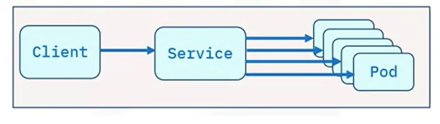

# IBM DevOps and Software Engineering Professional Certificate: Introduction to Containers w/ Docker, Kubernetes & OpenShift

These are my notes of the course [Introduction to Containers w/ Docker, Kubernetes & OpenShift](https://www.coursera.org/learn/ibm-containers-docker-kubernetes-openshift?specialization=devops-and-software-engineering).

I have some related repositories in which I compile a guide on Docker; this course is supposed to focus on Kubernetes.

- [udemy-docker-mastery](https://github.com/mxagar/udemy-docker-mastery)
- [tool_guides/docker_swarm_kubernetes](https://github.com/mxagar/tool_guides/tree/master/docker_swarm_kubernetes)
- [computer_vision_udacity/02_Cloud_Computing/IBM_Cloud_Notes.md](https://github.com/mxagar/computer_vision_udacity/blob/main/02_Cloud_Computing/IBM_Cloud_Notes.md)

In particular, the latter explains how to set up a trial IBM Cloud account with which we can run the exercises from this course. Otherwise, the environment provided in the course can be used, too.

Table of contents:

- [IBM DevOps and Software Engineering Professional Certificate: Introduction to Containers w/ Docker, Kubernetes \& OpenShift](#ibm-devops-and-software-engineering-professional-certificate-introduction-to-containers-w-docker-kubernetes--openshift)
  - [1. Introduction: Docker Containers](#1-introduction-docker-containers)
    - [1.1 First Example: Build, Run, Pull, Push](#11-first-example-build-run-pull-push)
    - [1.2 Docker objects](#12-docker-objects)
    - [1.3 Docker Architecture](#13-docker-architecture)
    - [1.4 Exercises](#14-exercises)
      - [First interaction](#first-interaction)
      - [Building the image](#building-the-image)
      - [Running the image](#running-the-image)
      - [Push image to IBM Cloud Registry](#push-image-to-ibm-cloud-registry)
      - [Cheatsheet](#cheatsheet)
  - [2. Setup and Installation](#2-setup-and-installation)
    - [2.1 Installation of Docker on WSL 2](#21-installation-of-docker-on-wsl-2)
    - [2.2 Install Databases on WSL 2](#22-install-databases-on-wsl-2)
    - [2.3 Creating an IBM Container Registry Namespace](#23-creating-an-ibm-container-registry-namespace)
  - [3. Kubernetes Basics](#3-kubernetes-basics)
    - [3.1 Kubernetes Architecture](#31-kubernetes-architecture)
    - [3.2 Kubernetes Objects](#32-kubernetes-objects)
    - [3.3 Kubernetes CLI: `kubectl`](#33-kubernetes-cli-kubectl)
      - [Common Commads](#common-commads)
    - [3.4 Exercises](#34-exercises)
      - [Connect to Cluster and Create a Pod with Imperative Commands](#connect-to-cluster-and-create-a-pod-with-imperative-commands)
      - [Create a Pod with Imperative Object Configuration](#create-a-pod-with-imperative-object-configuration)
      - [Create a Pod with a Declarative Command](#create-a-pod-with-a-declarative-command)
      - [Load Balancing the Application](#load-balancing-the-application)
  - [4. Managing Applications with Kubernetes](#4-managing-applications-with-kubernetes)
    - [4.1 ReplicaSet](#41-replicaset)
    - [4.2 Autoscaling](#42-autoscaling)
    - [4.3 Deployment Strategies](#43-deployment-strategies)
    - [4.4 Rolling Updates](#44-rolling-updates)
    - [4.5 ConfigMaps and Secrets](#45-configmaps-and-secrets)
      - [Secrets](#secrets)
    - [4.6 Service Binding](#46-service-binding)
    - [4.7 Summary of Commands to Manage Kubernetes Clusters](#47-summary-of-commands-to-manage-kubernetes-clusters)
    - [4.8 Exercises](#48-exercises)
      - [Set Up](#set-up)
      - [Deploy Service](#deploy-service)
      - [Scale Service](#scale-service)
      - [Rolling Updates](#rolling-updates)
      - [Using a ConfigMap to Store Configuration](#using-a-configmap-to-store-configuration)
      - [Autoscale the Application Using Horizontal Pod Autoscaler (HPA)](#autoscale-the-application-using-horizontal-pod-autoscaler-hpa)
  - [5. The Kubernetes Ecosystem: Red Hat OpenShift](#5-the-kubernetes-ecosystem-red-hat-openshift)
    - [5.1 Builds](#51-builds)
    - [5.2 Operators](#52-operators)
    - [5.3 Istio](#53-istio)
    - [5.4 Exercises: Open Shift](#54-exercises-open-shift)
      - [OpenShift Web UI](#openshift-web-ui)
      - [Scaling the Application in the Open Shift Web UI](#scaling-the-application-in-the-open-shift-web-ui)
    - [5.5 Glossary](#55-glossary)
  - [6. Capstone](#6-capstone)
    - [Evaluation Rubrics](#evaluation-rubrics)
    - [Setup](#setup)
    - [Fix](#fix)
    - [Dockerfile](#dockerfile)
    - [Deploy App](#deploy-app)
    - [Autoscale the Guestbook Application Using Horizontal Pod Autoscaler](#autoscale-the-guestbook-application-using-horizontal-pod-autoscaler)
    - [Perform Rolling Updates and Rollbacks on the Guestbook Application](#perform-rolling-updates-and-rollbacks-on-the-guestbook-application)
  - [Extra: Summary of Kubernetes Commands](#extra-summary-of-kubernetes-commands)

## 1. Introduction: Docker Containers

Benefits of containers:

- Apps and microservices encapsulated.
- Containers are platform independent.
- Scaling possible.
- Microservice applications become much easier.
- etc.

Docker / Containers are not the best option if:

- We need high performance
- The architecture is monolithic
- We have rich GUI features
- The app is a very limited desktop app

Concepts:

- Image
- Container: runnable instance of an image
- Dockerfile: image specification file
- Namespace: isolated workspace, where containers run
- Registries

### 1.1 First Example: Build, Run, Pull, Push

`Dockerfile`:

```Dockerfile
# Base image
FROM alpine
# Command
CMD ["echo", "Hello World!"]
```

Building and running:

```bash
# Build
# -t: tag
# my-app: repository
# v1: version
docker build -t my-app:v1

# Get all images
docker images

# Create/Run container
docker run my-app:v1

# Get running containers
docker ps -a

# Push images to a registr we're logged in, i.e., configured
docker push my-app:v1

# Retrive images from configured registries
docker pull nginx
```

### 1.2 Docker objects

Dockerfile:

```Dockerfile
# Common commads
FROM # base image
RUN # execute commands
CMD # default command for execution
```

Docker images:

- Instructions to build a container
- Composed by layers added sequentuially; when image is changed, only the layers on the top of the change are modified.

Image name:

```
hostname/repository:tag
docker.io/ubuntu:18.04
```

Other objects:

- Networks are used for isolated container communications
- Storage: volumes are used for persisting data after container stops
- Plugins: connect to external platforms

### 1.3 Docker Architecture

- Interaction via CLI, REST API or GUI
- Docker host server has the docker daemon: `dockerd`
  - It is distirbuted: the host server and the execution don't need to be on the same physical machine
- Daemon listens to interactions
- Daemon executes the commands
- Registry stores images: public, private


### 1.4 Exercises

An environment is generated with a Terminal.

The working directory contains a simple Node.js application that we will run in a container. The app will print a hello message along with the hostname. The following files are needed to run the app in a container:

- `app.js` is the main application, which simply replies with a hello world message.
- `package.json` defines the dependencies of the application.
- `Dockerfile` defines the instructions Docker uses to build the image.

I have replicated the folder in [`lab/01_ContainersAndDocker/`](./lab/01_ContainersAndDocker/), so the exercise can be carried out locally instead of using the provided environment. Also, note that [`IBM_Cloud_Notes.md`](https://github.com/mxagar/computer_vision_udacity/blob/main/02_Cloud_Computing/IBM_Cloud_Notes.md) explains how to set up an IBM Cloud account to use a Registry.

Here are the contents of the `Dockerfile` and the `app.js`:

```Dockerfile
FROM node:9.4.0-alpine
COPY app.js .
COPY package.json .
RUN npm install &&\
    apk update &&\
    apk upgrade
EXPOSE  8080
CMD node app.js
```

```javascript
var express = require('express')
var os = require("os");
var hostname = os.hostname();
var app = express()

app.get('/', function(req, res) {
  res.send('Hello world from ' + hostname + '! Your app is up and running!\n')
})
app.listen(8080, function() {
  console.log('Sample app is listening on port 8080.')
})
```

#### First interaction

```bash
docker --version
ibmcloud version
cd /home/project
# Clone a repository
[ ! -d 'CC201' ] && git clone https://github.com/ibm-developer-skills-network/CC201.git
cd CC201/labs/1_ContainersAndDocker/
ls # app.js  Dockerfile  package.json
docker pull hello-world
docker images # now, image is there
docker run hello-world
docker ps -a # containers with IDs
docker container rm <container_id> # f36c514edcd4
docker ps -a # container not there anymore
```

#### Building the image

```bash
# Build the image
docker build . -t myimage:v1
# Check image is there
docker images # base images appear, too
```

#### Running the image

```bash
docker run -dp 8080:8080 myimage:v1
curl localhost:8080
# Hello world from 0c0a10807bfd! Your app is up and running!

# Stop all running containers
docker stop $(docker ps -q)
# Check nothing is running
docker ps
```

#### Push image to IBM Cloud Registry

We have a custom (automatically generated IBM Cloud account).

```bash
# Check we're logged in
ibmcloud target

# Check namespaces we have access to
ibmcloud cr namespaces

# Set namespace region
ibmcloud cr region-set us-south

# Log local docker to IBM Cloud Container Registry to pull/push
ibmcloud cr login

# Create namespace env variable
export MY_NAMESPACE=sn-labs-$USERNAME

# Tag image befoe pushing
docker tag myimage:v1 us.icr.io/$MY_NAMESPACE/hello-world:1

# Push to registry the tagged image
docker push us.icr.io/$MY_NAMESPACE/hello-world:1

# Check the image is in the registry
ibmcloud cr images

# To view only images in my namespace
ibmcloud cr images --restrict $MY_NAMESPACE
```

#### Cheatsheet

Also, check my summary: [`docker_commands_summary.txt`](./docker_commands_summary.txt).

```bash
curl localhost 	# Pings the application.
docker build 	# Builds an image from a Dockerfile.
docker build . -t 	# Builds the image and tags the image id.
docker CLI 	# Start the Docker command line interface.
docker container rm # Removes a container.
docker images 	# Lists the images.
docker ps 	# Lists the containers.
docker ps -a 	# Lists the containers that ran and exited successfully.
docker pull 	# Pulls the latest image or repository from a registry.
docker push 	# Pushes an image or a repository to a registry.
docker run 	# Runs a command in a new container.
docker run -p 	# Runs the container by publishing the ports.
docker stop 	# Stops one or more running containers.
docker stop $(docker ps -q) 	# Stops all running containers.
docker tag 	# Creates a tag for a target image that refers to a source image.
docker –version 	# Displays the version of the Docker CLI.
exit 	# Closes the terminal session.

export MY_NAMESPACE 	# Exports a namespace as an environment variable.
ibmcloud cr images 	# Lists images in the IBM Cloud Container Registry.
ibmcloud cr login 	# Logs your local Docker daemon into IBM Cloud Container Registry.
ibmcloud cr namespaces 	# Views the namespaces you have access to.
ibmcloud cr region-set 	# Ensures that you are targeting the region appropriate to your cloud account.
ibmcloud target 	# Provides information about the account you’re targeting.
ibmcloud version 	# Displays the version of the IBM Cloud CLI.
```

## 2. Setup and Installation

Most of this section was done by myself, it's not included in the course.

Check: [tool_guides/docker_swarm_kubernetes](https://github.com/mxagar/tool_guides/tree/master/docker_swarm_kubernetes).

### 2.1 Installation of Docker on WSL 2

Links, sources:

- [Install Docker in WSL 2 without Docker Desktop](https://www.youtube.com/watch?v=SDk3pqFXgs8)

### 2.2 Install Databases on WSL 2

Even though relational databases are not related to Docker/Kubernetes, many apps require the usage of an SQL database. Therefore, I describe here how this is done.

Links, sources:

- [Get started with databases on Windows Subsystem for Linux](https://learn.microsoft.com/en-us/windows/wsl/tutorials/wsl-database)
- [Set up PostgreSQL on WSL2 and Access with pgAdmin on Windows](https://chloesun.medium.com/set-up-postgresql-on-wsl2-and-connect-to-postgresql-with-pgadmin-on-windows-ca7f0b7f38ab)

### 2.3 Creating an IBM Container Registry Namespace

A namespace is a slice of a registry to which you can push your images. We can create an IBM Cloud account and create a namespace in the Container Registry tool/service.

Check my notes at [computer_vision_udacity/02_Cloud_Computing/IBM_Cloud_Notes.md](https://github.com/mxagar/computer_vision_udacity/blob/main/02_Cloud_Computing/IBM_Cloud_Notes.md).

Also, there might be a symbolic link in the local cloned folder: [`IBM_Cloud_Notes.md`](./IBM_Cloud_Notes.md).

## 3. Kubernetes Basics

Kubernetes (aka. k8s) is the most popular and nowadays standard container orchestration system; other orchestration tools:

- Docker Swarm
- Marathon
- Nomad

Container orchestration is needed when we have several containers to build one app (several services). Orchestration handles the entire lifecycle of all the containers:

- Definition of the image locations in the registry
  - New container deployments are automatically scheduled
- Provisionining and Deployment
- Management
  - System parameters are controlled
  - File parameters too
- Scaling and load balancing
- Networking: secure
- Availability is assured
- Rolling updates or roll backs
- Health checks can be done

Typically, a configuration file in `YAML` or `JSON` is used.

Kubernetes **is not**

- a PaaS
- limited to Docker

Important Kubernetes concepts:

- Pods and workloads: smallest deployable compute object and the higher-level abstractions to run workloads.
- Services: applications running on sets of Pods.
- Storage: persistent and temporary storage for pods.
- Configuration: pod configuration.
- Security: for pod and API access.
- Policies: for groups so that pods can be found and managed.
- Schedule, Eviction: run/terminate pods depending on resources.
- Preemption: termination of pods if low priority so that others can run on nodes.
- Administration: Kubernetes cluster administration.
- Secrets: sensitive information storage and management (SSH keys, etc.).
- Self-healing: restarts/replaces pods if necessary
- Service discovery and load balancing: pods are discovered by IP or DNS.

Kubernetes ecosystem: many tools and providers.

### 3.1 Kubernetes Architecture

The following two images show the architecture of a **Kubernetes deployment**, also known as a **Kubernetes cluster**. Such a cluster is a deployment of an application which runs several containers arranged as we define.


From the images:

- The user interacts with the **Kubernetes Control Plane** via an UI or the `kubectl` CLI.
- The **Kubernetes Control Plane** controls and maintains the desired cluster state, e.g., monitoring of resources, scaling if necessary, etc.; it has these components:
    - `kube-api-server`: main API used by all components, like the front-end for k8s.
    - `etcd`: databse which stores cluster state and configuration data.
    - `kube-scheduler`: assigns created pods to nodes (considering resources, scheduling, etc.).
    - `kube-controller-manager`: monitors cluster state and assures it has the desired one.
    - `cloud-controller-manager`: controlers that interact with the underlying cloud provider. Kubernetes is Open Source and all cloud providers have an interface with it.
- Nodes = Worker machines. They can be virtual or physical. They are not created by Kubernetes, but by the cloud provider! They are managed by the control plane.
- Pods: are run in nodes; a pod is the smallest deployment entity and can contain several containers.
- Containers share the resources of the node and can communicate among themselves.
- `Kubelet`: it is a process running on each node which communicates with the `kube-api-server`; it ensures that the pods are running.
- Container runtime = Docker: it downloads the images and runs the containers. Usually Docker is employed but there are other options, too.
- `Kube-proxy`: it handles comms between pods, from within or outside.

### 3.2 Kubernetes Objects

Terminology:

- Object: something with **identity**, **state** and **behavior**.
- Entity: thing with identity and data.
- Persistent: which lasts.

Kubernetes objects are **persistent entities**; examples:

- Pods
- Namespaces
- ReplicaSets
- Deployments

Kubernets objects consist of two main fields:

- Object spec: desired state defined by user
- Status: current state

K8s works by trying to match the current state with the desired state.

Objects have:

- Labels: non-unique key-value pairs used for identification.
- Label selectors: used to group objects by their labels.

**Namespaces**: mechanims to isolate groups of resources in a single cluster.

**Pods**:

- Simplest unit in k8s
- A process running
- Encapsulates one or more containers
- We can replicate a Pod to scale it horizontally
- They are defined with a YAML, similar to the `docker-compose.yaml`.

```yaml
apiVersion: v1
kind: Pod
metadata:
  name: nginx
spec:
  containers:
  - name: nginx
    image: nginx:1.7.9
    ports:
    - containerPort: 80
```

**ReplicaSet**: horizontally scaled and identical running pods.

- Also defined in a YAML; we have the number of `replicas` and a Pod `template` definition in it.
- Creating ReplicaSets directly is not recommended; instead, we should create a **Deployment**, which is a higher level concept that manages ReplicaSets.

```yaml
apiVersion: apps/v1
kind: ReplicaSet
metadata:
  name: nginx-replicaset
  labels:
    app: nginx
spec:
  replicas: 3
  selector:
    matchLabels: # Pods with this label can be acquired
      app: nginx
  template:
    metadata:
      labels:
        app: nginx # must match matchLabels
    spec:
      containers:
      - name: web-server
        image: nginx:1.7.9
        ports:
        - containerPort: 80
```

A **Deployment** is a higher-level object which can handle/update Pods and ReplicaSets:

- We should use it instead of Pod/ReplicaSet definitions.
- It is suitable for stateless applications.

```yaml
apiVersion: apps/v1
kind: Deployment
metadata:
  name: nginx-deployment
  labels:
    app: nginx
spec:
  replicas: 3
  selector:
    matchLabels: # Pods with this label can be acquired
      app: nginx
  template:
    metadata:
      labels:
        app: nginx # must match matchLabels
    spec:
      containers:
      - name: web-server
        image: nginx:1.7.9
        ports:
        - containerPort: 80
```

A **Service** is a logical abstraction for sets of pods which can be accessed with an IP address. It is used because Pods are volatile (i.e., we can destroy and run them as we please), but the Service interface (with its IP) remains for the user/other components of the cluster. Properties:

- They are REST objects
- They facilitate the access to the Pods
- They keep track of Pod changes
- They act as a load balances across the pods
- They are assigned a unique IP address
- They support multiple protocols: TCP, UDP
- They suppor multiple ports
- They can map incoming ports to a tergtPort



There are four **types of services**:

- **ClusterIP**
  - Default, most common
  - Service has an IP reachable only within the cluster
    - Pods within cluster can communicate with Service
    - Pods outside cluster cannot access Service
  - We can set the IP in the service definition file
- **NodePort**
  - Extension of ClusterIP
  - It exposes the Service on each node's IP address at a static port
  - Then, comms are routed to the Service ClusterIP
  - Not recommended for production, due to security issues
- **External LoadBalancer (ELB)**
  - Extension of NodePort
  - It creates ClusterIPs and NodePorts first
  - Then, there is a load balancer which is the interface with the outside world
  - The load balancer routes outside comms to the corresponding NodePorts
  - Cloud providers have an ELB which can be used to expose our services to the internet
- **External Name**
  - DNS name mapped to a Service via the ELB
  - Used for external storage

Related to a **service**, we have these additional objects:

- **Ingress** is an API object which enables access/routing to Services from outside. Applications are exposed to the Internet on port 80 (HTTP) or 443 (HTTPS).
  - Difference to ELB: ELB is expensive and managed outside the cluster, while Ingress is cheaper and managed by the cluster.
- **DeamonSet** is an object which makes sure a Node runs a copy of a Pod, or it garbage-collects them when they are not necessary.
  - Note that use user adds/removes Pods to/from the cluster, but DeamonSet maps them to the Nodes.
  - If we delete a DeamonSet, all its Pods are removed.
  - They are used for monitoring Nodes, storage or logs.
- **StatefulSet** is an object which manages stateful applications.
  - It manages the deployment and scaling of pods.
  - It maintains a *sticky identity* for each Pod
  - It provides persistent storage volumes
- **Job** is an object which creates Pods
  - It tracks the creation process completion
  - Jobs are retried until completed
  - Suspeding a job deletes its active Pods
  - Can run several jobs in parallel
  - *CronJob*: regular jobs with an iterative schedule

### 3.3 Kubernetes CLI: `kubectl`

Kube-control = `kubectl` = Kubernetes (k8s) CLI.

```bash
# kubectl usage pattern/structure: order matters
kubectl [command] [type] [name] [flags]

# command: operation; create, get, apply, delete
# type: resource; pod, deployment, replicaset
# name: resource name, if applicable
# flags: options, modifiers to override default values
```

It has 3 command types:

1. Imperative commands: we can create/update/delete objects with a command, but we don't keep track/document the operation (so we lack of reproducibility if the entire command is not saved in a file), and they are limited.

    kubectl run nginx --image nginx

2. Imperative object configuration: we specify the operation and its flags in the command, but the objects configuration in a YAML config file passed to the command. We can save in a git repo the config file, so the reproducibility is better.

    kubectl create -f nginx.yaml

3. Declarative object configuration: in this option, the operations and their options are also in a YAML. So, everything is in a YAML. This is the best option: we define a desired state and k8s actualizes it.

    kubectl apply -f nginx/

#### Common Commads

```bash
kubectl version 	# Prints the client and server version information. 

kubectl run 	# Creates and runs a particular image in a pod.

kubectl get 	# Displays resources.
kubectl get services 	# Lists the services created.
kubectl get pods 	# Lists all the Pods in the current namespace
kubectl get pods -o wide 	# Lists all the Pods with details.
kubectl get pods --all-namespaces	# Lists all the Pods.

kubectl apply  # Applies a configuration to a resource.
kubectl apply -f ./my1.yaml -f ./my2.yaml
kubectl apply -f https://git.io/vPieo

kubectl scale --replicas=3 rs/foo # scale
kubectl scale --replicas=3 -f foo.yaml

kubectl get deployments 	# Lists the deployments created.

kubectl config get-clusters 	# Displays clusters defined in the kubeconfig.
kubectl config get-contexts 	# Displays the current context.
kubectl create 	# Creates a resource.
kubectl delete 	# Deletes resources.
kubectl describe 	# Shows details of a resource or group of resources.
kubectl expose 	# Exposes a resource to the internet as a Kubernetes service.
kubectl proxy 	# Creates a proxy server between a localhost and the Kubernetes API server.
```

### 3.4 Exercises

An environment is generated with a Terminal.

The working directory contains the same simple Node.js application that we will run in a container/Pod. The app will print a hello message along with the hostname. The following files are needed to run the app in a container/Pod:

- `app.js` is the main application, which simply replies with a hello world message.
- `package.json` defines the dependencies of the application.
- `Dockerfile` defines the instructions Docker uses to build the image.
- `hello-world-create.yaml`: YAML for imperative configuration command.
- `hello-world-apply.yaml`: YAML for declarative configuration command.

I have replicated the folder in [`lab/02_IntroKubernetes/`](./lab/02_IntroKubernetes/), so the exercise can be carried out locally instead of using the provided environment. However, in the environment we have already a cluster set up.

Also, note that [`IBM_Cloud_Notes.md`](https://github.com/mxagar/computer_vision_udacity/blob/main/02_Cloud_Computing/IBM_Cloud_Notes.md) explains how to set up an IBM Cloud account.

To recap, here are the contents of the `Dockerfile` and the `app.js`:

```Dockerfile
FROM node:9.4.0-alpine
COPY app.js .
COPY package.json .
RUN npm install &&\
    apk update &&\
    apk upgrade
EXPOSE  8080
CMD node app.js
```

```javascript
var express = require('express')
var os = require("os");
var hostname = os.hostname();
var app = express()

app.get('/', function(req, res) {
  res.send('Hello world from ' + hostname + '! Your app is up and running!\n')
})
app.listen(8080, function() {
  console.log('Sample app is listening on port 8080.')
})
```

#### Connect to Cluster and Create a Pod with Imperative Commands

```bash
kubectl version
# Major:"1", Minor:"25", GitVersion:"v1.25.9"

# Clone project files - NOT necessary locally
[ ! -d 'CC201' ] && git clone https://github.com/ibm-developer-skills-network/CC201.git
cd CC201/labs/2_IntroKubernetes/
ls
# app.js  Dockerfile  hello-world-apply.yaml  hello-world-create.yaml  package.json

# Get cluster information
kubectl config get-clusters
# labs-prod-kubernetes-sandbox/c8ana0sw0ljj8gkugn50

# A context is a group of access parameters,
# including a cluster, a user, and a namespace.
# View your current context
kubectl config get-contexts

# List all the Pods in your namespace
kubectl get pods

# Export namesace as env variable
export MY_NAMESPACE=sn-labs-$USERNAME

# Build and push the image
docker build -t us.icr.io/$MY_NAMESPACE/hello-world:1 . && docker push us.icr.io/$MY_NAMESPACE/hello-world:1

# Run the hello-world image as a container in Kubernetes
# --overrides option here enables us to specify the needed credentials to pull this image from IBM Cloud Container Registry
# This is an imperative command
kubectl run hello-world --image us.icr.io/$MY_NAMESPACE/hello-world:1 --overrides='{"spec":{"template":{"spec":{"imagePullSecrets":[{"name":"icr"}]}}}}'

# List the Pods in your namespace
kubectl get pods
kubectl get pods -o wide

# Describe the Pod to get more details about it
# A lot of info is shown: Pod, container, etc.
kubectl describe pod hello-world

# Delete the Pod; when done, check it's gone
kubectl delete pod hello-world
kubectl get pods
```

#### Create a Pod with Imperative Object Configuration

This exercise continues where the previous ended.

Instead of running the Pod with an imperative and manual command, we can define the Pod configuration in `hello-world-create.yaml` and launch it imperatively. This has the advantage that the configuration is persisted in the YAML, so we can use version control.

`hello-world-create.yaml`:

```yaml
apiVersion: v1
kind: Pod
metadata:
  name: hello-world
spec:
  containers:
  - name: hello-world
    # The namespace needs to be edited: sn-labs-mxagar
    image: us.icr.io/<my_namespace>/hello-world:1
    ports:
    - containerPort: 8080
  imagePullSecrets:
  - name: icr
```

```bash
# Create Pod: Imperative configuration
kubectl create -f hello-world-create.yaml

# Check it's there
kubectl get pods

# Delete it and check
kubectl delete pod hello-world
kubectl get pods
```

#### Create a Pod with a Declarative Command

This exercise continues where the previous ended.

Instead of running the Pod with an imperative configuration, we can define the Pod and command configuration in `hello-world-apply.yaml`, so we use a declarative command style. This has the advantage that everything is persisted in the YAML, so we can use version control.

`hello-world-apply.yaml`:

```yaml
apiVersion: apps/v1
kind: Deployment
metadata:
  generation: 1
  labels:
    run: hello-world
  name: hello-world
spec:
  replicas: 3
  selector:
    matchLabels:
      run: hello-world
  strategy:
    rollingUpdate:
      maxSurge: 1
      maxUnavailable: 1
    type: RollingUpdate
  template:
    metadata:
      labels:
        run: hello-world
    spec:
      containers:
        # The namespace needs to be edited: sn-labs-mxagar
      - image: us.icr.io/<my_namespace>/hello-world:1
        imagePullPolicy: Always
        name: hello-world
        ports:
        - containerPort: 8080
          protocol: TCP
        resources:
          limits:
            cpu: 2m
            memory: 30Mi
          requests:
            cpu: 1m
            memory: 10Mi   
      imagePullSecrets:
      - name: icr
      dnsPolicy: ClusterFirst
      restartPolicy: Always
      securityContext: {}
      terminationGracePeriodSeconds: 30
```

```bash
# Create Pod: Declarative command
# Kubernetes automatically creates a deployment
# with 3 pod replicas
kubectl apply -f hello-world-apply.yaml

# Check it's there
kubectl get deployments
kubectl get pods

# If we delete one pod, a new one will be created
# since the current state will be modified to match the desired
# state with 3 replicas
# Replace <pod_name> with a valid name obtained with 
# kubectl get pods
kubectl delete pod <pod_name> && kubectl get pods

# Wait and check we return to having 3 pods
kubectl get pods
```

#### Load Balancing the Application

This exercise continues where the previous ended.

We have a deployment and we want to expose it to the internet using a load balancer.

```bash
# This command creates what is called a ClusterIP Service.
# This creates an IP address that accessible within the cluster.
kubectl expose deployment/hello-world
# service/hello-world exposed

# Get services, with their ClusterIP
kubectl get services
# ... 172.21.87.140

# Split the Terminal: Temrinal > Split Terminal
# This assures that the environment variables are kept
# Now in the new terminal, we create a proxy.
# Note that a ClusterIP is not accessible from outside,
# but a proxy makes that possible.
# HOWEVER, we never do it so in a production environment.
kubectl proxy
# Starting to serve on 127.0.0.1:8001
# Now, we need to keep this window open
# When we finish, close it with Ctrl+C

# In the first Terminal, ping the app
curl -L localhost:8001/api/v1/namespaces/sn-labs-$USERNAME/services/hello-world/proxy
# Hello world from hello-world-5475f58c99-4sl8j! Your app is up and running!

# Note that the output includes the Pod name
# if we run it in a loop, the load balancer will route
# the request to different Pods
for i in `seq 10`; do curl -L localhost:8001/api/v1/namespaces/sn-labs-$USERNAME/services/hello-world/proxy; done
# Hello world from hello-world-5475f58c99-5h8qq! Your app is up and running!
# Hello world from hello-world-5475f58c99-5h8qq! Your app is up and running!
# Hello world from hello-world-5475f58c99-5h8qq! Your app is up and running!
# Hello world from hello-world-5475f58c99-4sl8j! Your app is up and running!
# Hello world from hello-world-5475f58c99-5h8qq! Your app is up and running!

# Delete the deployment and the service
kubectl delete deployment/hello-world service/hello-world

# Close the proxy with Ctrl+C
# in the second Terminal
```

## 4. Managing Applications with Kubernetes

### 4.1 ReplicaSet

ReplicaSets are Pod sets; in contrast to a ReplicaSet a single Pod **cannot**:

- Accomodate growing demans
- Handle outages
- Minimize downtime (with redundant executions)
- Auto restart on interruptions

A ReplicaSet:

- Add or deletes Pods for scaling or redundancy
- Replaces failing Pods or deletes additional Pods to maintain the desired state
- Should be used instead of a ReplicaController (older)

Notes:

- A ReplicaSet is best managed by a Deployment, i.e., we launch a Deployment, which creates ReplicaSets automatically, which contain Pods.
- A ReplicaSet doesn't own the Pods, it uses Pod labels to decide which Pods ti acquire to bring a deployment to a desired state. **In general, in Kubernetes objects are independent, not owned by other objects.**

Example: `hello-kubernetes.yaml`:

```yaml
apiVersion: apps/v1
kind: Deployment
metadata:
  name: hello-kubernetes
spec:
  selector:
    matchLabels: # Pods with this label can be acquired
      app: hello-kubernetes
  template: # Label of pod candiates to add/delete
    metadata:
      labels:
        app: hello-kubernetes # must match matchLabels
    spec:
      containers:
      - name: hello-kubernetes
        image: username/hello-kubernetes:1.5
        ports:
        - containerPort: 8080
```

If we start the deployment above:

```bash
# Declarative deployment
kubectl apply -f hello-kubernetes.yam

# Deployment: hello-kubernetes
kubectl get deployment

# ReplicaSet: hello-kubernetes-xxx
# In contrast to the Deployments, ReplicaSets and Pods have a number ending 
# ReplicaSet: <deployment>-xxx
# Pod: <deployment>-xxx-yyy
kubectl get replicaset # also: get rs

# Pod: hello-kubernetes-xxx-yyy
kubectl get pods
```

We could also deploy a ReplicaSet, but it's better to deploy a Deployment:

```yaml
apiVersion: apps/v1
kind: ReplicaSet # <- ReplicaSet
metadata:
  name: hello-kubernetes
spec:
  replicas: 1 # <- Number of Pods we want
  selector:
    matchLabels:
      app: hello-kubernetes
...
```

If we deploy a Deployment with a ReplicaSet inside, we can scale it in manually:

```bash
# Deploy: hello-kubernetes
kubectl create -f hello-kubernetes.yaml

# We see one pod: hello-kubernetes-xxx-yyy
# In contrast to the Deployments, ReplicaSets and Pods have a number ending 
# ReplicaSet: <deployment>-xxx
# Pod: <deployment>-xxx-yyy
kubectl get pods

# Info of the deployment
kubectl get deploy

# Scale: 3 Pods
# With this command we change the desired state
kubectl scale deploy hello-kubernetes --replicas=3

# Check we have 3 Pods: hello-kubernetes-xxx-yyy
kubectl get pods

# We can delete one Pod: hello-kubernetes-xxx-yyy
# Since the desired states is of 3 Pods, another one will be generated automatically
kubectl delete pod hello-kubernetes-xxx

# Check we have indeed 3 Pods: hello-kubernetes-xxx-yyy
kubectl get pods

# Similarly, if we create a Pod, it is deleted to match the desired state of 3!
kubectl create pod hello-kubernetes-xxx-yyy

# Check we have indeed 3 Pods: hello-kubernetes-xxx-yyy
kubectl get pods
```

### 4.2 Autoscaling

In the previous section we either decined the number of Pods or manually scaled them; however, it's better to scale as needed! Kubernetes allows autoscaling at two layers: (1) Cluster/node level and (2) Pod level, which means in practice that we have three types of autoscalers available:

- Horizontal Pod Autoscaler (HPA): increase/decrease the number of Pods
- Vertical Pod Autoscaler (VPA): inrease/decrease resource size (RAM) or speed of the Pods (CPU)
- Cluster Autoscaler (CA): adjust number of nodes (VMs), where Pods are added/removed

A typical use-case/scenario is an application which is differently consumed during the day, depending on whether people are working, eating, sleeping. Usually, a combination of the three is used.

Examples: 

```bash
# hello-kubernetes-xxx-yyy
kubectl get pods

# hello-kubernetes-xxx
kubectl get rs

# Autoscaling: minimum Pods 2, max 5, when CPU usage passes 50%, add/delete Pod
# We can also specify that in the specs of the YAML
kubectl autoscale deploy hello-kubernetes --min=2 --max=5 --cpu-percent=50

# Get specs for the HPA: minpods, maxpods, etc.
kubectl get hpa
```

### 4.3 Deployment Strategies

A deployment strategy defines:

- how to deploy ReplicaSets, Pods, etc.
- when to pause/resume Deployments
- when and how scale Deployments.

We have these types of Deployment Strategies:

1. **Recreate Strategy**: when the app is terminated and a new version of the app is deployed.
    - It's the simplest.
    - There's a downtime.

2. **Rolling (ramped) Strategy**: each Pod is updated one at a time, i.e., every single v1 Pod is terminated and replaced by a v2 sequentially.
    - No downtime.

3. **Blue/Green Strategy**: we have two live versions v1 and v2 of the application (in two different environments) and the load balancer switches the traffic to v2 when it passes all the tests.
    - Instantaneous, no downtime.
    - Expensive: it requires double the resources.

    

4. **Canary Strategy**: the new version v2 is tested by a subset of users; when successful, it is rolled out to all users.
    - More complex, gradual.
    - No downtime.

    

5. **A/B Testing Strategy**: used to evaluate two versions of an application; a subset of the users is randomly redirected to v1, whereas the rest to v2. Pre-defined metrics are measured.
    - Requires a specific load balancer.

    

6. **Shadow Strategy**: two versions are deployed, a live model and a *shadow* model; the difference is that the *shadow* model doesn't send back the responses to the user. The idea is to measure the app performance without interrupting the user experience.
    - Complex.
    - ??

    

### 4.4 Rolling Updates

Rolling updates = automated updates that occur on a schedules basis.

We distinguish:

- Roll out: a new version is deployed.
- Roll back: the new version is removed and the old re-deployed.

We can specify how to perform the rolling updates in the YAML file, i.e., any parameters we want.

Practical, simple example of how to **roll out** anew version:

```bash
# 3 Pods: hello-kubernetes-xxx-yyy
kubectl get pods

# Now, a new version of the code is committed
# Thus, we need to create a new tagged image
docker build -t hello-kubernetes .
dcoker tag hello-kubernetes username/hello-kubernetes:2.0
docker push username/hello-kubernetes:2.0

# Check the deployment: hello-kubernetes
kubectl get deployments

# Roll out: Set the new image tag
# 3 new pods will be rolled out
kubectl set image deployments/hello-kubernetes hello-kubernetes=username/hello-kubernetes:2.0

# Check the rollout: we should get "successfully rolled out"
kubectl rollout status deployments/hello-kubernetes

# Roll back if something is wrong
kubectl rollout undo deployments/hello-kubernetes

# Check Pods: we should see
kubectl get pods
```

Following the patterns introduced in the Deployment Strategies, we have different roll oy/back scenarios:

1. All-at-once rollout: all v1 objects removed and v2 objects become active; example above. There is a lag while terminating v1 and until v2 is up.
2. All-at-once rollback: equivalent to the previous, but v1 is re-deployed.
3. Once-at-a-time rollout: v1 Pods are replaced one by one by v2 Pods. There is no lag, no downtime/interruption.
4. Once-at-a-time rollback: equivalent to the previous, but v1 is re-deployed one by one.


### 4.5 ConfigMaps and Secrets

Configuration parameters should not be hard-coded. ConfigMap is an API which stores key-value pairs of non-confidential/secret configuration data (limited to 1 MB):

- It is visible to all the objects.
- It is reusable across deployments.
- We can create it in varios forms: inserting string literals to `kubectl` commands, providing key-value pairs, witha YAML file, etc.

Example: String literal:

```bash
# Here we are creteing a my-config object of type ConfigMap
# and it has a key-value pair: MESSAGE="Hello"
kubectl create ConfigMap my-config --from-literal=MESSAGE="Hello"
```

Once the ConfigMap is created, we need to reference it in the YAML:

```yaml
env:
- name: MESSAGE
  valueFrom:
    configMapKeyRef:
      name: my-config
      key: MESSAGE
```

Example: File with key-value pairs:

```bash
# Here we are creteing a my-config object of type ConfigMap
# and it is sourced from config.txt, contains lines in the form <key>=<value> 
kubectl create ConfigMap my-config --from-file=config.txt

# Show contents of my-config ConfigMap
kubectl describe ConfigMap my-config
```

It is also possible to do it with YAML file which follows the k8s format.

#### Secrets

In contrast to ConfigMaps, Secrets are encrypted. We operate with them in a similar manner:

```bash
# Create secret from string literal: secret name = api-creds
kubectl create secret generic api-creds --from-literal=key=mypassword

# Show secret - content is not displayed, only the name: api-creds
kubectl get secret
kubectl describe secret api-creds

# Output (encrypted) secret
kubectl get secret api-creds -o YAML
```

To use the secret, we need to reference it:

```yaml
env:
- name: API_CREDS
  valueFrom:
    secretKeyRef:
      name: api-creds
      key: key
```

We can also load teh secrets with volume-mounts.

### 4.6 Service Binding

Service binding: we can consume external services or backing services:

- Configuration and credentials are managed.
- Credentials are available to the users via secrets.
- Consumption is done binding the application to a deployment.


### 4.7 Summary of Commands to Manage Kubernetes Clusters

```bash
kubectl autoscale deployment 	# Autoscales a Kubernetes Deployment.
kubectl create configmap 	# Creates a ConfigMap resource.
kubectl get deployments -o wide 	# Lists deployments with details.
kubectl get hpa 	# Lists Horizontal Pod Autoscalers (hpa)
kubectl scale deployment 	# Scales a deployment.
kubectl set image deployment 	# Updates the current deployment.
kubectl rollout 	# Manages the rollout of a resource.
kubectl rollout restart 	# Restarts the resource so that the containers restart.
kubectl rollout undo 	# Rollbacks the resource. 
```

### 4.8 Exercises

An environment is generated with a Terminal.

The working directory contains the same simple Node.js application that prints a hello message along with the hostname as in the previous exercises. The following files are needed:

- `app.js` is the main application, which simply replies with a hello world message.
- `package.json` defines the dependencies of the application.
- `Dockerfile` defines the instructions Docker uses to build the image.
- `deployment.yaml`: YAML for 
- `deployment-configmap-env-var.yaml`: YAML for 

I have replicated the folder in [`lab/03_K8sScaleAndUpdate/`](./lab/03_K8sScaleAndUpdate/), so the exercise can be carried out locally instead of using the provided environment. However, in the environment we have already a cluster set up.

Also, note that [`IBM_Cloud_Notes.md`](https://github.com/mxagar/computer_vision_udacity/blob/main/02_Cloud_Computing/IBM_Cloud_Notes.md) explains how to set up an IBM Cloud account.

Objectives:

> - Scale an application with a ReplicaSet
> - Apply rolling updates to an application
> - Use a ConfigMap to store application configuration
> - Autoscale the application using Horizontal Pod Autoscaler

To recap, here are the contents of the `Dockerfile` and the `app.js`:

```Dockerfile
FROM node:9.4.0-alpine
COPY app.js .
COPY package.json .
RUN npm install &&\
    apk update &&\
    apk upgrade
EXPOSE  8080
CMD node app.js
```

```javascript
var express = require('express')
var os = require("os");
var hostname = os.hostname();
var app = express()

app.get('/', function(req, res) {
  res.send('Hello world from ' + hostname + '! Your app is up and running!\n')
})
app.listen(8080, function() {
  console.log('Sample app is listening on port 8080.')
})
```

Additionally, here are the contents of the YAML files:

`deployment.yaml`:

```yaml
apiVersion: apps/v1
kind: Deployment
metadata:
  name: hello-world
spec:
  selector:
    matchLabels:
      run: hello-world
  template:
    metadata:
      labels:
        run: hello-world
    spec:
      containers:
      - name: hello-world
        # <my_namespace> needs to be changed: sn-labs-mxagar
        image: us.icr.io/<my_namespace>/hello-world:1
        ports:
        - containerPort: 8080
        resources:
          limits:
            cpu: 2m
            memory: 30Mi
          requests:
            cpu: 1m
            memory: 10Mi  
        
      imagePullSecrets:
        - name: icr

```

`deployment-configmap-env-var.yaml` (note the reference to the ConfigMap):

```yaml
apiVersion: apps/v1
kind: Deployment
metadata:
  name: hello-world
spec:
  selector:
    matchLabels:
      run: hello-world
  template:
    metadata:
      labels:
        run: hello-world
    spec:
      containers:
      - name: hello-world
        # <my_namespace> needs to be changed: sn-labs-mxagar
        image: us.icr.io/<my_namespace>/hello-world:3
        ports:
        - containerPort: 8080
        envFrom:
        - configMapRef:
            name: app-config
      imagePullSecrets:
        - name: icr
```

#### Set Up

```bash
# Open an Terminal and clone repo
cd /home/project
[ ! -d 'CC201' ] && git clone https://github.com/ibm-developer-skills-network/CC201.git
ls # CC201
cd CC201/labs/3_K8sScaleAndUpdate/
ls # files above

# Set environment variable to be used in the YAMLs
export MY_NAMESPACE=sn-labs-$USERNAME

# Build and push image
docker build -t us.icr.io/$MY_NAMESPACE/hello-world:1 . && docker push us.icr.io/$MY_NAMESPACE/hello-world:1
```

#### Deploy Service

```bash
# Fetch variable
echo $MY_NAMESPACE
# Change <my_namespace> in both YAMLs to be what we echoed

# Deploy with apply: declarative command, 
# i.e., we define the desired state to which k8s tries to arrive
kubectl apply -f deployment.yaml

# Get deployed pods: hello-world-xxx-yyy
kubectl get pods
# NAME                           READY   STATUS    RESTARTS   AGE
# hello-world-7cc4c8bfbd-l8v9w   1/1     Running   0          17s

# Expose app to Internet
kubectl expose deployment/hello-world
# service/hello-world exposed

# However, the default ClusterIP services are reachable only inside the cluster
# To make them externally accessible, we can create a proxy
# NOTE: This is not how it should be done in production...
# To that end: WE OPEN A SECOND TERMINAL AND START A PROXY
# ... and leave it running
# We don't need to touch this second terminal but for closing everything
kubectl proxy
# Starting to serve on 127.0.0.1:8001

# IN THE FIRST TERMINAL
# We interact with the app/service
curl -L localhost:8001/api/v1/namespaces/sn-labs-$USERNAME/services/hello-world/proxy
# Hello world from hello-world-7cc4c8bfbd-l8v9w! Your app is up and running!
```

#### Scale Service

Note: the `kubectl proxy` should be running on a second terminal.

```bash
# Scale up to 3 replicas
kubectl scale deployment hello-world --replicas=3

# Get pods, check 3  replicas
kubectl get pods
# NAME                           READY   STATUS    RESTARTS   AGE
# hello-world-7cc4c8bfbd-5qz54   1/1     Running   0          18s
# hello-world-7cc4c8bfbd-jr67k   1/1     Running   0          18s
# hello-world-7cc4c8bfbd-l8v9w   1/1     Running   0          28m

# Ping app to check load balancer: notice a different Pod is reached every time
for i in `seq 10`; do curl -L localhost:8001/api/v1/namespaces/sn-labs-$USERNAME/services/hello-world/proxy; done
# Hello world from hello-world-7cc4c8bfbd-l8v9w! Your app is up and running!
# Hello world from hello-world-7cc4c8bfbd-jr67k! Your app is up and running!
# Hello world from hello-world-7cc4c8bfbd-l8v9w! Your app is up and running!
# Hello world from hello-world-7cc4c8bfbd-jr67k! Your app is up and running!
# Hello world from hello-world-7cc4c8bfbd-jr67k! Your app is up and running!
# Hello world from hello-world-7cc4c8bfbd-l8v9w! Your app is up and running!
# Hello world from hello-world-7cc4c8bfbd-jr67k! Your app is up and running!
# Hello world from hello-world-7cc4c8bfbd-l8v9w! Your app is up and running!
# Hello world from hello-world-7cc4c8bfbd-l8v9w! Your app is up and running!
# Hello world from hello-world-7cc4c8bfbd-5qz54! Your app is up and running!

# Scale down
kubectl scale deployment hello-world --replicas=1

# Check
kubectl get pods
# NAME                           READY   STATUS        RESTARTS   AGE
# hello-world-7cc4c8bfbd-5qz54   1/1     Terminating   0          2m49s
# hello-world-7cc4c8bfbd-jr67k   1/1     Terminating   0          2m49s
# hello-world-7cc4c8bfbd-l8v9w   1/1     Running       0          31m

# Check again
kubectl get pods
# NAME                           READY   STATUS    RESTARTS   AGE
# hello-world-7cc4c8bfbd-l8v9w   1/1     Running   0          32m
```

#### Rolling Updates

In this exercise, the *Welcome string* in `app.js` file is slightly changed and we roll an update.

Note: the `kubectl proxy` should be running on a second terminal.

```bash
# Change line in app.js
# "Hello..." <-> "Welcome..."

# Build new image version and push it
docker build -t us.icr.io/$MY_NAMESPACE/hello-world:2 . && docker push us.icr.io/$MY_NAMESPACE/hello-world:2

# List images in the IBM container registry
ibmcloud cr images

# Set the new image to the deployment: new image is rolled out
kubectl set image deployment/hello-world hello-world=us.icr.io/$MY_NAMESPACE/hello-world:2

# Get a status of the rolling update
kubectl rollout status deployment/hello-world
# deployment "hello-world" successfully rolled out

# Get deployments, -wide: image tag version is shown; check it's 2
kubectl get deployments -o wide
# NAME          READY   UP-TO-DATE   AVAILABLE   AGE   CONTAINERS    IMAGES                                   SELECTOR
# hello-world   1/1     1            1           22m   hello-world   us.icr.io/sn-labs-mxagar/hello-world:2   run=hello-world

# Ping app
curl -L localhost:8001/api/v1/namespaces/sn-labs-$USERNAME/services/hello-world/proxy
# Hello from hello-world-7f6ccc74ff-ngngt! Your app is up and running!

# Undo the rollout
kubectl rollout undo deployment/hello-world
kubectl rollout status deployment/hello-world

# Get deployments, -wide: image tag version is shown; check it's 1
kubectl get deployments -o wide
```

#### Using a ConfigMap to Store Configuration

> ConfigMaps and Secrets are used to store configuration information separate from the code so that nothing is hardcoded. It also lets the application pick up configuration changes without needing to be redeployed.
> To demonstrate this, we'll store the application's message in a ConfigMap so that the message can be updated simply by updating the ConfigMap.

Note: the `kubectl proxy` should be running on a second terminal.

```bash
# Create a ConfigMap that contains a new message
kubectl create configmap app-config --from-literal=MESSAGE="This message came from a ConfigMap!"
```

Now, we need to change `app.js` to use the ConfigMap, which is already referenced in `deployment-configmap-env-var.yaml`:

```javascript
app.get('/', function(req, res) {
  //res.send('Hello from ' + hostname + '! Your app is up and running!\n')
  res.send(process.env.MESSAGE + '\n')
})
```

```bash
# Build & push new image
docker build -t us.icr.io/$MY_NAMESPACE/hello-world:3 . && docker push us.icr.io/$MY_NAMESPACE/hello-world:3

# Launch new deloyment
kubectl apply -f deployment-configmap-env-var.yaml

# Ping your application again to see if the message from the environment variable is returned
curl -L localhost:8001/api/v1/namespaces/sn-labs-$USERNAME/services/hello-world/proxy
# This message came from a ConfigMap!

# Because the configuration is separate from the code, the message can be changed without rebuilding the image
kubectl delete configmap app-config && kubectl create configmap app-config --from-literal=MESSAGE="This message is different, and you didn't have to rebuild the image!"

# Restart the Deployment so that the containers restart.
# This is necessary since the environment variables are set at start time.
kubectl rollout restart deployment hello-world

# Ping your application again to see if the new message from the environment variable is returned
curl -L localhost:8001/api/v1/namespaces/sn-labs-$USERNAME/services/hello-world/proxy
# This message is different, and you didn't have to rebuild the image!
```

#### Autoscale the Application Using Horizontal Pod Autoscaler (HPA)

In this section, a new version is prepared for `deployment.yaml`, i.e., `deployment_v2.yaml`:

```yaml
apiVersion: apps/v1
kind: Deployment
metadata:
  name: hello-world
spec:
  selector:
    matchLabels:
      run: hello-world
  template:
    metadata:
      labels:
        run: hello-world
    spec:
      containers:
      - name: hello-world
        # <my_namespace> needs to be changed
        image: us.icr.io/<my_namespace>/hello-world:1
        ports:
        - containerPort: 8080
          name: http
        resources:
          limits:
            cpu: 50m
          requests:
            cpu: 20m        
      imagePullSecrets:
        - name: icr

```

In the new version, the specs of the container are different.

Note: the `kubectl proxy` should be running on a second terminal.

Then, we apply the deployment:

```bash
# Deploy
kubectl apply -f deployment_v2.yaml

# Autoscale the hello-world deployment
kubectl autoscale deployment hello-world --cpu-percent=5 --min=1 --max=10

# Check
kubectl get hpa hello-world
# NAME          REFERENCE                TARGETS        MINPODS   MAXPODS   REPLICAS   AGE
# hello-world   Deployment/hello-world   <unknown>/5%   1         10        1          21s

# Use the app: we spam it and are expected to get more Pod instances (autoscaling)
for i in `seq 100000`; do curl -L localhost:8001/api/v1/namespaces/sn-labs-$USERNAME/services/hello-world/proxy; done

# In another terminal
kubectl get hpa hello-world --watch
# NAME          REFERENCE                TARGETS   MINPODS   MAXPODS   REPLICAS   AGE
# hello-world   Deployment/hello-world   40%/5%    1         10        3          3m48s
# hello-world   Deployment/hello-world   45%/5%    1         10        6          4m1s
# hello-world   Deployment/hello-world   40%/5%    1         10        9          4m16s
# hello-world   Deployment/hello-world   18%/5%    1         10        9          4m31s

# Delete deployment
kubectl delete deployment hello-world

# Delete service
kubectl delete service hello-world
```

## 5. The Kubernetes Ecosystem: Red Hat OpenShift

Open Shift is a proprietary platform from Red Hat, which now belongs to IBM.

Open Shift is

> an enterprise-ready Kubernetes container platform built for an open hybrid cloud strategy.

So, I would say it is **a layer on top of Kubernetes which makes cloud clusters more manageable and easier to use.**


Open Shift Platform Architecture:

- It runs on top of a Kubernetes cluster
- Object data stored in the etcd key-value store.
- It has a microservices-based architecture.
- Docker containers are used.
- Features that provides Open Shift in cmparison to Kubernetes:
  - Soure code management: builds, deployment
  - Image management
  - Application management
  - Networking infrastructure
- It has a CLI: `oc`; additionally, `kubectl` can be used, too, but `oc` is supposed to have more functionalities and to be easier.

### 5.1 Builds

In a build we transform code into an executable object, e.g., `Source Code -> Container Image`. We need a **`BuildConfig`** file, which defines input sources and a build strategy:

- Common build strategies:
  - Source to image: S2I; reproducible container images are built by injecting app code into images without the need of Dockerfiles.
  - Docker: we need a Dockerfile + artifacts; it invokes `docker build & push` automatically, so it's semi-automated.
  - Custom: regular Dockerfiles and Doker pipeline, which needs to be defined manually; that would be the traditional way. It offers the largest flexibility (e.g., for CI/CD) but is available only to cluster administrators.
- Input sources can be combined (in order of overwriting precedence):
  - Inline Docker definitions
  - Content extracted from images
  - Git repos
  - Binary inputs
  - Input secrets
  - External artifacts

An **`ImageStream`** is an abstraction for referencing container images within Open Shift:

- A single `ImageStream` can consists of several image tags: latest, dev, test.
- Images are updated continuously when code is modified.
- Each tag points to an image in a registry, which can be different for each tag.

We can automate builds using the following **triggers**:

- `Webhook` trigger: send a request to Open Shift Container Platform API endpoint; Github wenhooks can be used.
- Image change trigger: when a new version of an image is available.
- Configuration change trigger: build when a new configuration is defined.

### 5.2 Operators

> Operators automate cluster tasks and act as a custom controller to extend the Kubernetes API.
> Operators run in a Pod; they package, deploy, and manage native apps in Kubernetes, automate other tasks, and ensure all relevant components are included.


**Custom resource definitions (CRD)** store and retrieve objects in the Kubernetes API, extending it and making it more modular and flexible. They can be accessed via `kubectl`. 

**Custom controllers** run in operator Pods and use the CRDs to bring the cluster to a desired state; this is known as the *Operator Pattern*.


There is a complete **Operator Framework** which makes use of all the introduced constructs.

### 5.3 Istio

Istio is a **service mesh**.

Service mesh = dedicated infrastructure layer for

- Traffic management
- Security
- Policy enforcement
- Observability

Istio is platform-independent, often used in Kubernetes.


### 5.4 Exercises: Open Shift

Objectives:

> - Use the `oc` CLI (OpenShift command line interface)
> - Use the OpenShift web console
> - Build and deploy an application using s2i (‘Source-to-image’ build strategy)
> - Inspect a BuildConfig and an ImageStream
> - Autoscale the application

```bash
# Check version
oc version

# Clone repo
cd /home/project
[ ! -d 'CC201' ] && git clone https://github.com/ibm-developer-skills-network/CC201.git

# OpenShift projects are Kubernetes namespaces with additional administrative functions
# oc comes with a copy of kubectl, so all the kubectl commands can be run with oc
oc get pods

# In addition to Kubernetes objects, you can get OpenShift specific objects
oc get buildconfigs
# Because we haven't created a BuildConfig yet, this will not return any resources

# View the OpenShift project that is currently in use
oc project
```

#### OpenShift Web UI

In this section an Open Shift Web UI is opened.

We'll see that there are two profiles/perspectives: `Administrator` and `Developer`.

We choose the `Developer` profile and navigate in it. The `Developer` profile can be used to create and deploy apps.


Deploy an application in the web console:

- `+Add`
- Git repository
  - https://github.com/sclorg/nodejs-ex.git
  - (Select Node.js builder image)
  - Create
- Now, in the Topology section (left menu) we should see the created app: `nodejs-ex-git`; note:
  - The Github icon
  - The green check icon: it means the code was built and deployed
  - The blue arrow outwards: it means the app is reachable from the outside
  
- If we click on the Node.js deployment, we see in the Resources panel (it appears from the right):
  - a Pod that runs the containerized application
  - a Build that uses the S2I strategy to build the application into a container image
  - a Service that exposes the application as a network service
  - and a Route that provides an externally reachable hostname
  
- In Topology > (choose app Deploymet) > Builds
  - View logs: observe all the steps: clone repo, Dockerfile, etc.
  - Details > Owner: BuildConfig YAML can be visualized
  - Details > Output To: ImageStreamTag is shown
- In Topology > (choose app Deploymet) > Routes: if we click on the URL, the app opens
  

#### Scaling the Application in the Open Shift Web UI

We set up a horizontal pod autoscaler (HPA) so that it can handle any load that comes its way.

We're going to request 3 millicores of CPU and 40 MB of RAM. We’ll limit the containers to 30 millicores and 100 MB.

    Topology view: Click on nodejs-ex-git Deployment
    Actions > Edit deployment: YAML view

Modify `template.spec.containers.resources` with the following definition and `Save`:

```yaml
          resources:
            limits:
              cpu: 30m
              memory: 100Mi
            requests:
              cpu: 3m
              memory: 40Mi
```

Then, in the main web UI, we choose the `Administrator` profile/perspective.

    Workloads > Horizontal Pod Autoscalers
    Click Create Horizontal Pod Autoscaler

Then we paste the following snippet in the YAML configurator and click on `Create`:

```yaml
apiVersion: autoscaling/v2
kind: HorizontalPodAutoscaler
metadata:
  name: nodejs-ex-git-hpa
spec:
  scaleTargetRef:
    apiVersion: apps/v1
    kind: Deployment
    name: nodejs-ex-git
  minReplicas: 1
  maxReplicas: 3
  metrics:
    - type: Resource
      resource:
        name: cpu
        target:
          type: Utilization
          averageUtilization: 10
```

> This HPA indicates that we're going to scale based on CPU usage. Generally you want to scale when your CPU utilization is in the 50-90% range. For this example, we're going to use 10% so that the app is more likely to need scaling. The `minReplicas` and `maxReplicas` fields indicate that the Deployment should have between one and three replicas at any given time depending on load.

Now, in the Terminal we run:

```bash
# Contact the app 1000 times to increase load
# App-URL: Web UI (Developer) > Topology > (Choose Node.js App) > Routes: Copy URL
for i in `seq 1000`; do curl -L <App-URL>; done
for i in `seq 1000`; do curl -L https://nodejs-ex-git-sn-labs-mxagar.labs-prod-openshift-san-a45631dc5778dc6371c67d206ba9ae5c-0000.us-east.containers.appdomain.cloud; done

# We get the app HTML code
```

Now, we click on 

    Web UI (Developer) > Topology > (Choose Node.js App) > HorizontalPodAutoscalers: nodejs-ex-git-hpa
      Scale target: nodejs-ex-git
      Deployment details: we should see 3 Pods

So Open Shift automatically scaled the Deployment.

### 5.5 Glossary

In the following, the Glossary as provided by IBM is cited:

> - A/B testing: Strategy is mostly used for testing new features in front-end applications. It is used to evaluate two versions of the application namely A and B, to assess which one performs better in a controlled environment. The two versions of the applications differ in terms of features and cater to different sets of users. Based on the interaction and responses received from the users such as feedback, you can choose one of the versions of the application that can be deployed globally into production.
> - Build: The process of transforming inputs into a resultant object.
> - BuildConfig: An OpenShift-specific object that defines the process for a build to follow. The build process makes use of the input sources and the build strategy. The BuildConfig is the blueprint, and the build is an instance of that blueprint.
> - Canary Deployments: Aims to deploy the new version of the application by gradually increasing the number of users. The canary deployment strategy uses the real users to test the new version of the application. As a result, bugs and issues can be detected and fixed before the new version of the application is deployed globally for all the users.
> - Circuit breaking: A method to prevent errors in one microservice from cascading to other microservices.
> - Configuration Change: A trigger that causes a new build to run when a new BuildConfig resource is created.
> - Control Plane: The control plane takes the desired configuration and its view of the services and dynamically programs and updates the proxy servers as the environment changes.
> - Custom build strategy: Requires you to define and create your own builder image.
> - Custom builder images: Are regular Docker images that contain the logic needed to transform the inputs into the expected output.
> - CRDs: Custom code that defines a resource to add to your Kubernetes API server without building a complete custom server.
> - Custom controllers: Reconcile the custom resources (CRDs) actual state with its desired state.
> - Data plane: Communication between services is handled by the data plane. If a service mesh is absent, the network cannot identify the type of traffic that flows, the source, and the destination and make any necessary decisions.
> - Enforceability (Control): Istio provides control by enforcing policies across an entire fleet and ensures resources are fairly distributed among consumers.
> - Envoy proxy: All network traffic is subject to or intercepted by a proxy, called Envoy, used by the service mesh and allows many features depending on the configuration.
> - Human operators: Understand the systems they control. They know how to deploy services and how to recognize and fix problems.
> - Image Change: A trigger to rebuild a containerized application when a new or updated version of an image is available. For example, if an application is built using a Node.js base image, that image will be updated as security fixes are released and other updates occur.
> - ImageStream: An abstraction for referencing container images within OpenShift. Each image contains an ID, or digest, that identifies it. ImageStreams do not contain image data but rather are pointers to image digests.
> - ImageStream Tag: An identity to the pointer in an ImageStream that points to a certain image in a registry.
> - Istio: A platform-independent and popular service mesh platform, often used with Kubernetes. It intelligently controls the flow of traffic and API calls between services, conducts a range of tests and reduces the complexity of managing network services. Istio secures services through authentication, authorization, and encryption. Istio provides control by defining policies that can be enforced across an entire fleet. With Istio, you can observe traffic flow in your mesh so you can trace call flows, dependencies, and you can view service communication metrics such as latency, traffic, errors and saturation.
> - Man-in-the-middle attacks: A man-in-the-middle (MiTM) attack is a type of cyber-attack where the attacker secretly intercepts and relays messages between two parties who believe they are communicating directly with each other. The attack is a type of eavesdropping in which the attacker intercepts and then controls the entire conversation.
> - Observability: Helps to observe the traffic flow in your mesh, trace call flows and dependencies, and view metrics such as latency and errors.
> - OpenShift: A hybrid cloud, enterprise Kubernetes application.
> - OpenShift CI/CD process: Automatically merges new code changes to the repository, builds, tests, approves, and deploys a new version to different environments.
> - Operators: Automate cluster tasks and act as a custom controller to extend the Kubernetes API.
> - Operator Framework: Is a family of tools and capabilities to deliver an efficient customer experience. It is not just about writing code; what is also critical is testing, delivery, and updating Operators.
> - OperatorHub: Web console lets cluster administrators find Operators to install on their cluster. It provides many different types of Operators available, including Red Hat Operators, Certified Operators from independent service vendors partnered with Red Hat, Community Operators from the open-source community but not officially supported by Red Hat, and custom Operators defined by users.
> - Operator Lifecycle Manager: (or OLM) Controls the install, upgrade, and role-based access control (or RBAC) of Operators in a cluster.
> - Operator maturity model: Defines the phases of maturity for general day two Operations activities and ranges from Basic Install to Auto Pilot.
> - Operator Pattern: A system design that links a Controller to one or more custom resources.
> - Operator Registry: Stores CRDs, cluster service versions (CSVs), and Operator metadata for packages and channels. It runs in Kubernetes or OpenShift clusters to provide the Operator catalog data to OLM.
> - Operator SDK: (which includes Helm, Go, and Ansible) Helps authors build, test, and package their Operators without requiring knowledge of Kubernetes API complexities.
> - postCommit: Section defines an optional build hook.
> - Retries: A method to prevent errors in one microservice from cascading to other microservices.
> - runPolicy: Field controls how builds created from a build configuration need to run. Values include the default Serial (sequentially) and simultaneously.
> - Service Broker: Provides a short-running process that cannot perform the consecutive day’s operations such as upgrades, failover, or scaling.
> - Service Mesh: A dedicated layer for making service-to-service communication secure and reliable. It provides traffic management to control the flow of traffic between services, security to encrypt traffic between services, and observability of service behavior; so, you can troubleshoot and optimize applications.
> - Software operators: Try to capture the knowledge of human operators and automate the same processes.
> - Source-to-Image: A tool for building reproducible container images. Also abbreviated S2i, it injects application source code into a container image to produce a ready-to-run image.
> - Source strategy: Section shows the strategy used to execute the build, such as a Source, Docker, or Custom strategy.
> - Source type: Determines the primary input like a Git repository, an inline Dockerfile, or binary payloads.
> - Webhook: A trigger that sends a request to an OpenShift Container Platform API endpoint. Often this will be a GitHub webhook, though it can also be a generic webhook. If a GitHub webhook is utilized, GitHub can send the request to OpenShift when there is a new commit on a certain branch, or a pull request is merged, or under many more circumstances. Webhooks are a great way to automate development flows so that builds can occur automatically as new code is developed. 

## 6. Capstone

We need to

> deploy a simple guestbook application which will have a text input where one can enter any text and submit it. For all of these, we will create Kubernetes Deployments and Pods. Then we will apply Horizontal Pod Scaling to the Guestbook application and finally, work on Rolling Updates and Rollbacks.

I am not adding the app code to the current guide/repository. Here's the file structure:


The submitted screenshots can be found in [`lab/capstone/submission/`](./lab/capstone/submission/).

### Evaluation Rubrics

> For each of the ten tasks, provide a screenshot and upload the JPEG (.jpg) file for your peers to review when you submit your work.
> - Task 1: Updating the Dockerfile. (5 points)
> - Task 2: The guestbook image being pushed to IBM Cloud Container Registry correctly. (1 point)
> - Task 3: Index page of the deployed Guestbook – v1 application. (2 points)
> - Task 4: Horizontal Pod Autoscaler creation. (1 point)
> - Task 5: The replicas in the Horizontal Pod Autoscaler being scaled correctly. (2 points)
> - Task 6: The Docker build and push commmands for updating the guestbook.(2 points)
> - Task 7: Deployment configuration for autoscaling. (1 point)
> - Task 8: Updated index page of the deployed Guestbook – v2 application after rollout of the deployment. (2 points)
> - Task 9: The revision history for the deployment after rollout of the deployment. (2 points)
> - Task 10: The udpated deployment after Rollback of the update. (2 points)

### Setup

In a new Terminal:

```bash
# Clone project
cd /home/project
[ ! -d 'guestbook' ] && git clone https://github.com/ibm-developer-skills-network/guestbook
cd guestbook
ls # LICENSE  README.md  v1  v2
cd v1/guestbook
export MY_NAMESPACE=sn-labs-$USERNAME
```

### Fix

At the time I was completing the capstone there was a credential issu when pushing the created image.

Martin Õunap [posted a solution](https://www.coursera.org/learn/ibm-containers-docker-kubernetes-openshift/discussions/forums/mPEdxysGEe2kQwqqRFPELQ/threads/k4QpROVqEe6YmA7AUB4Frw) to it:

    Login to https://cloud.ibm.com
    Find from catalog "Container Registry"
        Click start using it
        Use Dallas location - IMPORTANT to use Dallas, since later services expect it to be there
        Create namespace
            Use custom namespace, not the one, what is provisioned for you (it just says it is in use)
                In my case I created sn-labs-mikel
                This will be now the MY_NAMESPACE variable
    Create Access for registry
        In up menu Manage select Access (IAM)
        From left select "Service IDs"
        Create new service
            NB: Service needs to be named "container-registry"
        Assign group
            I assigned group "Public Access"
            In reality, it does not do anything right now, because we are assigning access through "Access policies"
            But you can create group and use it instead policies
        Click to "Assign access"
            Search for "Container Registry"
            Resource: all
            Roles
                Read
                Write
            Create it
        Now create API key for that service
            Copy it, you need it in next steps: API_KEY
    Now in IBM Cloud click to person icon in up right
        Click to "Login in to CLI and API"
        Copy IBM cloud CLI: IBM_CLI_PASSCODE
        This is a one-time-use only password that let's us login in via CLI
    Paste CLI what you copied to lab terminal
    Now you can login to "ibmcloud login"
        ibmcloud login -a https://cloud.ibm.com -u passcode -p <IBM_CLI_PASSCODE>
            Select US-South if asked (Dallas)
        If we want to log in again using this method, we need to create a new PW with
            "Login in to CLI and API"
    And I used docker login; note that the ICR is in US!
        docker login -u iamapikey -p <API_KEY> us.icr.io
    Create kubernetes docker registry secret
        kubectl create secret docker-registry <SECRET_NAME> --docker-server=us.icr.io --docker-username=iamapikey --docker-password=<API_KEY> --docker-email=ibm@ibm.com
        Later, in the deployment.yaml we need to reference the SECRET_NAME
        Now use that secret in deployment
            https://kubernetes.io/docs/tasks/configure-pod-container/pull-image-private-registry/#create-a-pod-that-uses-your-secret
            PS: You need to use secret name what you did use in secret creation


### Dockerfile

Complete the Dockerfile; note that [multi-stage builds](https://docs.docker.com/build/building/multi-stage/) are used.

```dockerfile
FROM golang:1.15 as builder
RUN go get github.com/codegangsta/negroni
RUN go get github.com/gorilla/mux
RUN go get github.com/xyproto/simpleredis/v2
COPY main.go .
RUN go build main.go

FROM ubuntu:18.04
# --from=builder specifies that the source of the copy operation is the filesystem of the builder stage
COPY --from=builder /go/main /app/guestbook
COPY public/index.html /app/public/index.html
COPY public/script.js /app/public/script.js
COPY public/style.css /app/public/style.css
COPY public/jquery.min.js /app/public/jquery.min.js

WORKDIR /app
#  Default command to run when the container starts
CMD ["./guestbook"]
EXPOSE 3000
```

Then:

```bash
## -- FIX 
# Due to the fix, we need to set some variables
export MY_NAMESPACE=sn-labs-mikel
export IBM_CLI_PASSCODE=xxx
export API_KEY=yyy
export SECRET_NAME=zzz # we can pick a name of our choice, kube-cr-secret

# Log in
ibmcloud login -a https://cloud.ibm.com -u passcode -p $IBM_CLI_PASSCODE
# Select US South, if asked
docker login -u iamapikey -p $API_KEY us.icr.io 

# Create a secret in Kubernetes for accessing a private Docker registry,
# like IBM Cloud Container Registry (us.icr.io).
# This secret allows Kubernetes to authenticate with the registry
# to pull private images for your deployments
kubectl create secret docker-registry $SECRET_NAME --docker-server=us.icr.io --docker-username=iamapikey --docker-password=$API_KEY --docker-email=ibm@ibm.com

## -- BUILD IMAGE and PUSH to CONATINER REGISTRY

# Build the guestbook app using the Docker Build
docker build . -t us.icr.io/$MY_NAMESPACE/guestbook:v1
 
# Push the image to IBM Cloud Container Registry
docker push us.icr.io/$MY_NAMESPACE/guestbook:v1

# Verify that the image was pushed successfully
ibmcloud cr images
```

### Deploy App

Prepare the `deployment.yaml` file:

```yaml
apiVersion: apps/v1
kind: Deployment
metadata:
  name: guestbook
  labels:
    app: guestbook
spec:
  replicas: 1
  selector:
    matchLabels:
      app: guestbook
  strategy:
    rollingUpdate:
      maxSurge: 25%
      maxUnavailable: 25%
    type: RollingUpdate
  template:
    metadata:
      labels:
        app: guestbook
    spec:
      containers:
      - image: us.icr.io/sn-labs-mikel/guestbook:v1
        imagePullPolicy: Always
        name: guestbook
        ports:
        - containerPort: 3000
          name: http
        resources:
          limits:
            cpu: 50m
          requests:
            cpu: 20m
      # Due to the fix, we need to reference the SECRET; replace its value
      imagePullSecrets:
      - name: <SECRET_NAME>
```

```bash
# Apply the deployment
kubectl apply -f deployment.yml
# deployment.apps/guestbook configured

# Check the Pod is running
kubectl get pods
# NAME                                     READY   STATUS      RESTARTS   AGE
# guestbook-6c9cc9f99b-n4phj               1/1     Running     0          27s

# Open a New Terminal and enter the below command to view your application
kubectl port-forward deployment.apps/guestbook 3000:3000
```

After that we launch the application as specified in the execise guide, using the port 3000.


### Autoscale the Guestbook Application Using Horizontal Pod Autoscaler

```bash
# Autoscale the Guestbook deployment
kubectl autoscale deployment guestbook --cpu-percent=5 --min=1 --max=10

# Check the current status of the newly-made HorizontalPodAutoscaler
kubectl get hpa guestbook
# NAME        REFERENCE              TARGETS        MINPODS   MAXPODS   REPLICAS   AGE
# guestbook   Deployment/guestbook   <unknown>/5%   1         10        0          7s

# Get the app URL from the app web
export APP_URL=https://mxagar-3000.theiaopenshiftnext-1-labs-prod-theiaopenshift-4-tor01.proxy.cognitiveclass.ai/
# Load the app with many requests
kubectl run -i --tty load-generator --rm --image=busybox:1.36.0 --restart=Never -- /bin/sh -c "while sleep 0.01; do wget -q -O- $APP_URL; done"
# This returns the HTML code of the app all the time

# In a new/another terminal, check the load 
kubectl get hpa guestbook --watch
# NAME        REFERENCE              TARGETS   MINPODS   MAXPODS   REPLICAS   AGE
# guestbook   Deployment/guestbook   0%/5%     1         10        1          3m52s
# guestbook   Deployment/guestbook   20%/5%    1         10        1          4m16s
# guestbook   Deployment/guestbook   20%/5%    1         10        4          4m31s
# guestbook   Deployment/guestbook   25%/5%    1         10        4          4m46s
# guestbook   Deployment/guestbook   25%/5%    1         10        5          5m2s
# guestbook   Deployment/guestbook   30%/5%    1         10        5          5m17s
# guestbook   Deployment/guestbook   30%/5%    1         10        6          5m32s
# guestbook   Deployment/guestbook   45%/5%    1         10        6          5m47s
# ...

# Interrupt the load command and get the HPA details
kubectl get hpa guestbook
# NAME        REFERENCE              TARGETS   MINPODS   MAXPODS   REPLICAS   AGE
# guestbook   Deployment/guestbook   3%/5%     1         10        10         9m29s

# Finally: close the other terminals where load generator and port-forward commands are running
```

### Perform Rolling Updates and Rollbacks on the Guestbook Application

First, update the title and header in `index.html` to any other suitable title and header like <Your name> Guestbook - v2 & Guestbook - v2.

```html
<!DOCTYPE html>
<html lang="en">
  <head>
    <meta content="text/html; charset=utf-8" http-equiv="Content-Type">
    <meta charset="utf-8">
    <meta content="width=device-width" name="viewport">
    <link href="style.css" rel="stylesheet">
    <title>Mikel's Guestbook - v2</title> <!-- HERE -->
  </head>
  <body>
    <div id="header">
      <h1>Guestbook - v2</h1> <!-- HERE -->
    </div>

    <div id="guestbook-entries">
      <link href="https://afeld.github.io/emoji-css/emoji.css" rel="stylesheet">
      <p>Waiting for database connection... <i class='em em-boat'></i></p>
      
    </div>

    <div>
      <form id="guestbook-form">
        <input autocomplete="off" id="guestbook-entry-content" type="text">
        <a href="#" id="guestbook-submit">Submit</a>
      </form>
    </div>

    <div>
      <p><h2 id="guestbook-host-address"></h2></p>
      <p><a href="env">/env</a>
      <a href="info">/info</a></p>
    </div>
    <script src="jquery.min.js"></script>
    <script src="script.js"></script>
  </body>
</html>
```

Then, build and push a new image:

```bash
# Go to directory
cd .../guestbook/v1/guestbook

# Build and push the updated app image
export MY_NAMESPACE=sn-labs-mikel
docker build . -t us.icr.io/$MY_NAMESPACE/guestbook:v1 && docker push us.icr.io/$MY_NAMESPACE/guestbook:v1
```

After that, update the `deployment.yaml`:

```yaml
apiVersion: apps/v1
kind: Deployment
metadata:
  name: guestbook
  labels:
    app: guestbook
spec:
  replicas: 1
  selector:
    matchLabels:
      app: guestbook
  strategy:
    rollingUpdate:
      maxSurge: 25%
      maxUnavailable: 25%
    type: RollingUpdate
  template:
    metadata:
      labels:
        app: guestbook
    spec:
      containers:
      - image: us.icr.io/sn-labs-mikel/guestbook:v1
        imagePullPolicy: Always
        name: guestbook
        ports:
        - containerPort: 3000
          name: http
        resources:
          # New limits: 50m -> 5m, 20m -> 2m
          limits:
            cpu: 5m
          requests:
            cpu: 2m
      imagePullSecrets:
      - name: kube-cr-secret
```

And deploy it:

```bash
kubectl apply -f deployment.yml

# Open a new terminal and run the port-forward command again
kubectl port-forward deployment.apps/guestbook 3000:3000

# Launch your application on port 3000 as done before
# We should see the web with the "v2" headline.
# WARNING: sometimes the old web is cached, so we need to refresh the page...
```

Now, we perform some rollouts:

```bash
# See the history of deployment rollouts
kubectl rollout history deployment/guestbook
# deployment.apps/guestbook 
# REVISION  CHANGE-CAUSE
# 1         <none>
# 2         <none>

# See the details of Revision of the deployment rollout
kubectl rollout history deployments guestbook --revision=2
# deployment.apps/guestbook with revision #2
# Pod Template:
#   Labels:       app=guestbook
#         pod-template-hash=5889966998
#   Containers:
#    guestbook:
#     Image:      us.icr.io/sn-labs-mikel/guestbook:v1
#     Port:       3000/TCP
#     Host Port:  0/TCP
#     Limits:
#       cpu:      5m
#     Requests:
#       cpu:      2m
#     Environment:        <none>
#     Mounts:     <none>
#   Volumes:      <none>

# Run the below command to get the replica sets and observe the deployment which is being used now
kubectl get rs
# NAME                               DESIRED   CURRENT   READY   AGE
# guestbook-5889966998               1         1         1       82s
# guestbook-6c9cc9f99b               0         0         0       103s

# Run the below command to undo the deploymnent and set it to Revision 1
kubectl rollout undo deployment/guestbook --to-revision=1
# deployment.apps/guestbook rolled back

# Run the below command to get the replica sets after the Rollout has been undone
kubectl get rs
# NAME                               DESIRED   CURRENT   READY   AGE
# guestbook-5889966998               0         0         0       3m6s
# guestbook-6c9cc9f99b               1         1         1       3m27s
```


## Extra: Summary of Kubernetes Commands

Which is the configuration of a pod in a cluster? (e.g., memory, etc.)

```bash
# Get all pods in the cluster: pick the pod name you want to look into
kubectl --kubeconfig k8s/config --namespace your-env get pods

# Get infos of that pod
kubectl --kubeconfig k8s/config --namespace your-env describe pod pod-name-xxx
```

